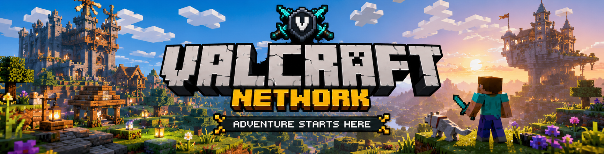
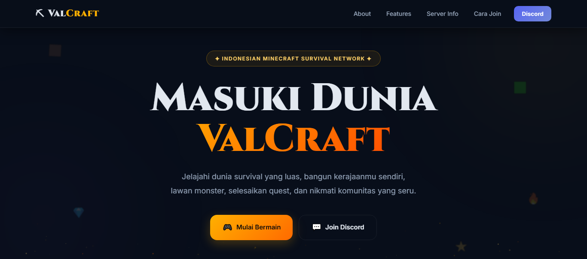

# 🌌 Valcraft Network

<p align="center">
  
</p>

<p align="center">
  
  
  
</p>

<p align="center">
  <b>⚔️ Begin Your Legendary Adventure ⚔️</b>
</p>

<p align="center">
  Modern Minecraft community & server network built for players who love adventure, survival, and unforgettable experiences.
</p>

---

# ✨ Features

* ⚡ Modern Minecraft Landing Page
* 🌙 Dark Gaming User Interface
* 📱 Fully Responsive on All Devices
* 🎮 Server Information & Features Section
* 🔗 Discord Community Integration
* ✨ Smooth Animations & Effects
* 🚀 Lightweight & Fast Performance
* 🎨 Clean & Professional Design

---

# 📸 Preview

<p align="center">
  
</p>

---

# 📂 Project Structure

```bash
Valcraft/
├── index.html
├── assets/
│   ├── favicon.ico
│   └── Preview-Web.png
│   └── ValCraft-Banner.png
├── css/
│   └── style.css
├── js/
│   └── script.js
├── README.md
└── LICENSE
```

---

# 🌍 Deployment

You can deploy this project easily using:

* GitHub Pages
* Netlify
* Vercel
* Cloudflare Pages

---

# 🛠️ Technologies Used

* HTML5
* CSS3
* JavaScript
* Font Awesome
* Google Fonts

---

# 🎮 About Valcraft Network

**Valcraft Network** is a modern Minecraft community server designed to bring players together through exciting gameplay, events, and adventures.

Whether you enjoy survival, PvP, exploration, or simply hanging out with friends, Valcraft offers an immersive experience for everyone.

> *"Adventure Starts Here."*

---

# 🌐 Official Links

### 🔹 Website

```txt
https://valcraft.dpdns.org
```

### 🔹 Discord Server

```txt
https://dsc.gg/basecamp
```

---

# 🤝 Community

Join our Discord community to:

* 📢 Get server updates
* 🎉 Participate in events
* 🛡️ Report bugs & issues
* 💬 Chat with other players
* 🎮 Find teammates & friends

---

# 📄 License

This project is licensed under the **MIT License**.

---

# ❤️ Credits

<p align="center">
  Designed & Developed with ❤️ by <b>PanduAsmara</b>
</p>

<p align="center">
  © 2026 Valcraft Network. All rights reserved.
</p>
